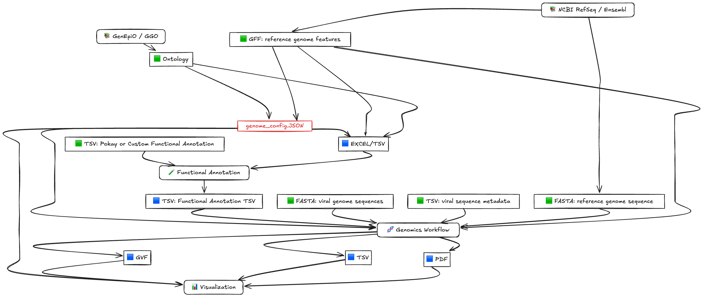

# VIRUS-MVP

VIRUS-MVP is a heatmap-centric visualization web application that encodes
mutational information across viral populations e.g., SARS-CoV-2 & MPOX.
You can find deployed versions of VIRUS-MVP (without user upload functionality)
at https://virusmvp.org/.

![app_interface]

[app_interface]: assets/screenshots/app_interface.png

The data visualized by VIRUS-MVP is generated and annotated by two upstream
components of this project:

- [nf-ncov-voc][nf-ncov-voc] - genomics workflow for variant calling and
                               annotation
- [pokay][pokay]             - mutation function annotation repository

[nf-ncov-voc]: https://github.com/cidgoh/nf-ncov-voc/
[pokay]: https://github.com/nodrogluap/pokay/

![data_to_app]

[data_to_app]: assets/screenshots/data_to_app.png

## Native vs Docker installation

VIRUS-MVP can be installed natively, or built through Docker.

A **native installation** will provide optimal performance on Windows and Mac
machines, as there are varying performance costs associated with the Linux
virtualization layer used to build Docker containers. VIRUS-MVP docker
containers also use port mapping, which incurs additional performance costs.

However, **Docker** installations are highly portable. Installing VIRUS-MVP
through Docker maintains a consistent and reproducible environment across
systems, with minimal dependency errors. This consistency is especially useful
when deploying the application, as variability between testing and production
environments will be reduced.

## Native installation steps with pip

### 0. _(If uploading your own data)_ Install [Nextflow][nf] + [Docker][docker]

File uploads trigger the [nf-ncov-voc][nf-ncov-voc] workflow written in
[Nextflow][nf].

[nf]: https://docs.seqera.io/nextflow/install
[docker]: https://docs.docker.com/get-docker/

### 1. Clone the repository and its submodules

`$ git clone git@github.com:cidgoh/VIRUS-MVP.git --recurse-submodules`

### 2. Setup a `venv` environment

This does not provide the same performance overhead of a Docker container, as
all `venv` will do is create a unique folder for the dependencies you will
install natively on your operating system.

`$ cd VIRUS-MVP`

`$ python3 -m venv myenv`

`$ source myenv/bin/activate`

`(myenv) $ pip install -r requirements.txt`

[venv]: https://docs.python.org/3/library/venv.html

### 3. Run the application

`(myenv) $ python app.py`

Go to http://0.0.0.0:8050/.

_Note: Run the app from the **root project directory** to ensure all assets
(e.g., JavaScript) load correctly._

## Native installation steps with Pixi

**Supported platforms:** Bioconda supports only Linux (64-bit and AArch64) and macOS (x86_64 and ARM64)

### 0. _(If uploading your own data)_ Install [Docker][docker]

File uploads trigger the [nf-ncov-voc][nf-ncov-voc] workflow written in
[Nextflow][nf]. The Bioconda Nextflow package will be resolved by Pixi.

[nf]: https://docs.seqera.io/nextflow/install
[docker]: https://docs.docker.com/get-docker/

### 1. Clone the repository and its submodules

`$ git clone git@github.com:cidgoh/VIRUS-MVP.git --recurse-submodules`

### 2. Setup a `Pixi` environment
`$ cd VIRUS-MVP`

- Make sure the Docker Server is running before proceeding.
  `$ docker info`

`$ pixi install`
### 3. Run the application

`$ pixi run python app.py`

Go to http://0.0.0.0:8050/.

To run the application locally / in a browser:

Go to http://127.0.0.1:8050/ or http://localhost:8050/.

_Note: Run the app from the **root project directory** to ensure all assets
(e.g., JavaScript) load correctly._

## Docker installation steps

It is a relatively simple setup. Just make sure you have Docker installed.

`$ docker-compose build`

`$ docker-compose up`

**Warning:** our docker setup bind mounts the host socket to the container. You
should use a socket proxy prior to deployment.

**One currently unresolved issue:** If you upload a file while the application
is deployed through Docker, and then later attempt to upload a file while the
application is deployed natively, the application will likely run into
permission issues related to the _nf-ncov-voc_ cache. You can fix this by
removing all cache files in the `nf-ncov-voc/` directory:

`$ rm -r results work .nextflow .nextflow.log* capsule  framework  plugins  secrets  tmp`

You may have to use `sudo`.

## Usage

A navbar at the top of the application has links to both this repository and the
underlying genomics workflow. Clicking the "TUTORIAL" link will display this
README in-app.

![navbar]

[navbar]: assets/screenshots/navbar.png

A legend at the top of application provides a detailed explanation of the
heatmap view.

![legend]

[legend]: assets/screenshots/legend.png

### Heatmap view

The left axis encodes viral lineages. Lineages belonging to VOC are in
**bold**, and lineages belonging to VOI are in _italics_. Actively circulating
lineages are denoted with ⚠️.

The right axis encodes the number of genomic sequences analyzed for each
lineage.

The top axis encodes the nucleotide position of lineage mutations, with respect
to the reference genome.

The bottom axis encodes the amino acid position of lineage mutations, in the
following format:

**Genic mutations:** `{GENE}.{AMINO ACID POSITION WITHIN THAT GENE}`

**Intergenic:** `{NEAREST DOWNSTREAM GENE}. {NUMBER OF NUCLEOTIDES UPSTREAM}`

The heatmap cells encode the presence of mutations. The color of these cells
encodes mutation frequency. Insertions, deletions, functional mutations, and
lineages with a sample size of one are encoded as follows:

![heatmap_cells]

[heatmap_cells]: assets/screenshots/heatmap_cells.png

Hovering over cells displays detailed mutation information. Clicking cells opens
a modal with detailed mutation function descriptions, and their citations.

![scroll_hover_click]

[scroll_hover_click]: assets/screenshots/heatmap_scroll_hover_click.gif

### Histogram

The histogram bars encode the total number of mutations across all visualized
lineages every 100 nucleotide positions. The little black bar at the bottom of
the histogram view indicates which section of genome you have currently
scrolled to in the heatmap.

![histogram_hover_scroll]

[histogram_hover_scroll]: assets/screenshots/histogram_hover_scroll.gif

**To navigate the heatmap more quickly**, you can click on the genes in the
histogram view. Clicking a gene in the histogram will automatically scroll the
heatmap to the left-most mutation in that gene.

### Toolbar

There are several tools in the top of the interface that can be used to edit the
visualization.

![select_lineages_btn]

[select_lineages_btn]: assets/screenshots/select_lineages_btn.png

Clicking the select groups button opens a modal that
allows you to rearrange and hide variants.

![upload_btn]

[upload_btn]: assets/screenshots/upload_btn.png

Clicking the upload button allows you to upload a FASTA or VCF file,
which will then be processed by _nf-ncov-voc_ to generate a new GVF file, and
then rendered onto the heatmap. You can find examples of files users can upload
in [test_data/][3].

[3]: https://github.com/cidgoh/VIRUS-MVP/tree/development/test_data

_You must have Nextflow and Conda installed to upload files._

_Your first upload will take a while. Subsequent uploads will be faster._

![download_btn]

[download_btn]: assets/screenshots/download_btn.png

Clicking the download dropdown menu  allows you to download
surveillance reports generated by _nf-ncov-voc_ for the lineages visible in the
heatmap. You can also download a mutation index JSON file, which provides
parsable data on all the information rendered in the heatmap.

![search_for_mutations_btn]

[search_for_mutations_btn]: assets/screenshots/search_for_mutations_btn.png

Clicking the "search for mutations" button allows you to search for specific
mutations by name, and automatically scroll the heatmap to that mutation.

![jump_to_nt_pos_input]

[jump_to_nt_pos_input]: assets/screenshots/jump_to_nt_pos_input.png

Typing a nucleotide position in the "jump to nucleotide position" textbox will
automatically scroll the heatmap to that specific nucleotide position.

![mutation_freq_slider]

[mutation_freq_slider]: assets/screenshots/mutation_freq_slider.gif

The mutation frequency slider allows you to filter heatmap cells by mutation
frequency.

![clade_defining_switch]

[clade_defining_switch]: assets/screenshots/clade_defining_switch.gif

The clade defining switch allows you to filter in and out heatmap cells
corresponding to non-clade defining mutations.

## Adapting the workflow to new a virus

To adapt this workflow for a new virus, users must provide a defined set of
input files. These are processed through two modular components:
- **[🧪 Genomics Workflow][nf-ncov-voc]**
- **[🧬 Functional Annotation][pokay]**

The figure below summarizes all required inputs (🟩), outputs generated by the
workflow (🟦), and hybrid files that require both manual curation and automated
generation (🟪).

TODO commit asset

### ✅ Required user-provided files (🟩):

TODO fill out example links

#### Reference genome files
  - [`GFF`](https://example.com/example.gff) —
    Reference genome annotations (e.g., from NCBI RefSeq or Ensembl)
  - [`FASTA`](https://example.com/example.fasta) —
    Reference genome sequence

#### Ontology file

  - [`GenEpiO` or `GGO`](https://example.com/example.owl) —
    Ontologies for mapping gene functions

#### Viral genome sequences

  - [`FASTA`](https://example.com/virus_sequences.fasta) —
    Assembled viral genomes
  - [`TSV`](https://example.com/virus_metadata.tsv) —
    Associated metadata

#### Functional annotations (optional)

  - [`TSV`](https://example.com/pokay_annotation.tsv) —
    Functional annotation file in Pokay or custom format

### 🟪 Most Important File: `genome_config.JSON`

> **⚠️ Critical for customization**  
> [`genome_config.JSON`](./assets/genome_config.json) is the most important
> file for adapting the workflow to a new virus.
> It acts as the central resource file connecting reference features,
> ontologies, and annotations.

- **Partially auto-generated** using provided inputs and helper scripts
- **Manual curation is required** for accurate ontology term mapping,
  virus-specific details, and layout configuration
- This file controls how genomic features and annotations are interpreted and
  visualized across all components of the framework

### ⚙️ Script-generated files (🟦):

- `GVF`, `Functional Annotation TSV`, metadata `TSVs`, and summary `PDFs`
- These are produced automatically by the workflow after running the Genomics
  Workflow and Functional Annotation pipelines

## Future directions

We plan to build an API, which users can call to retrieve a text-based
representation of the information rendered in VIRUS-MVP. We have begun this
process by introducing the ability to download a mutation index JSON file, as
mentioned above.

We also plan to modify the interface for a more intuitive display of segmented
genomes, such as RSV or Influenza. You can track our progress on the
[`segmented_demo`][4] branch. Basically, we will provide a dropdown that allows
users to render discrete segments of the genome, one at a time.

[4]: https://github.com/cidgoh/VIRUS-MVP/tree/segmented_demo

## Support

We encourage you to add any problems with the application as an issue in this
repository, but you can also email us at contact@cidgoh.ca.

## Authors and acknowledgement

[@ivansg44][ivan]: Visualization development

[@anwarMZ][zohaib]: Genomic analysis

[@Anoosha-Sehar][anoosha]: Functional annotation

[@miseminger][madeline]: Functional annotation and data standardization

[ivan]: https://github.com/ivansg44
[anoosha]: https://github.com/Anoosha-Sehar
[zohaib]: https://github.com/anwarMZ
[madeline]: https://github.com/miseminger

William Hsiao, Gary Van Domselaar, and Paul Gordon

The results here are in whole or part based upon data hosted at the Canadian
VirusSeq Data Portal: https://virusseq-dataportal.ca/. We wish to acknowledge
the following organisations/laboratories for contributing data to the Portal:
Canadian Public Health Laboratory Network (CPHLN), CanCOGGeN VirusSeq,
Saskatchewan - Roy Romanow Provincial Laboratory(RRPL), Nova Scotia Health
Authority, Alberta ProvLab North(APLN), Queen's University / Kingston Health
Sciences Centre, National Microbiology Laboratory(NML), BCCDC Public Health
Laboratory, Public Health Ontario(PHO), Newfoundland and Labrador - Eastern
Health, Unity Health Toronto, Ontario Institute for Cancer Research(OICR),
Manitoba Cadham Provincial Laboratory, and Manitoba Cadham Provincial
Laboratory.

## License

[MIT][5]

[5]: LICENSE
